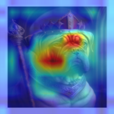

## 1. SLIC

By default, SKImage enforces connectivity between superpixels. This leads to a much more coherent result for images that are noisy (e.g. handles leaves better). The major drawback of my algorithm is that I did not implement this. However, when I toggle the `enforce_connectivity` flag in the SKImage implementation, the results are comparable to that of my algorithm.

### `compactness=10`

#### Mine


#### Skimage `enforce_connectivity=False`


#### Skimage `enforce_connectivity=True`


### `compactness=30`

#### Mine


#### Skimage `enforce_connectivity=False`


#### Skimage `enforce_connectivity=True`


### `compactness=50`

#### Mine


#### Skimage `enforce_connectivity=False`


#### Skimage `enforce_connectivity=True`


## 2. Grad-CAM

### Demo 1

```bash
python main.py demo1 -i shrek.jpeg -a resnet152 -t layer4
```

| Predicted Class | #1 mask | #3 neck brace |
| - | - | - |
| Grad-CAM |  |  |
| Vanilla backpropagation |  |  |
| Guided Grad-CAM |  |  |

### Demo 2

```
python main.py demo2 -i bull_mastiff.jpg  
python main.py demo2 -i perturbed.jpg  
```

| Layer | `relu` | `layer1` | `layer2` | `layer3` | `layer4` |
| - | - | - | - | - | - |
| Grad-CAM |  |  |  |  |  |
| Grad-CAM (After Perturbation) |  |  |  |  |  |
